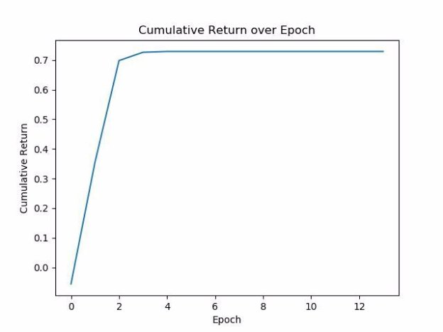
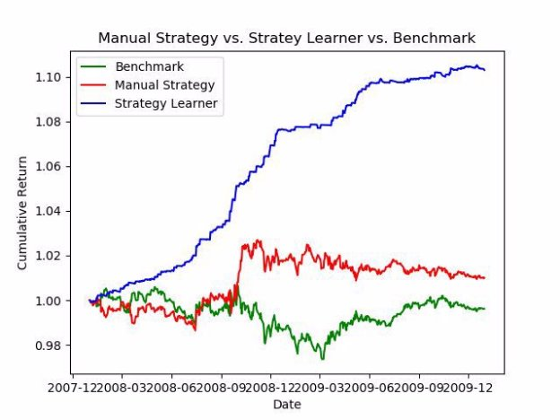
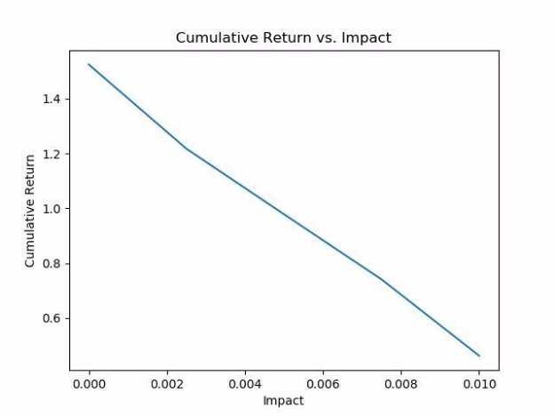
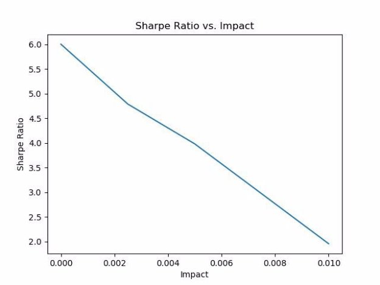

# ML-for-Trading-Q-Learning
Applying Q-Learning to stock market trades to maximize portfolio return
By: Sarah Hernandez 

**Framing the Problem:** 

I used three indicators: Momentum, Simple Moving Average, and Bollinger Bands. Because I calculated both high and lower Bollinger Bands, my code functionally uses four indicators to create its trades dataframe. To frame the problem, I broke down the question into concrete baby steps. I knew that before I tested any policy, I would have to train one. Because of the limited training window and the need for Q-learners to ‘explore’ their environment, I knew that I would implement multiple runs through the same training timeframe. This thinking translated into the use of epochs. Originally set to 1000, I lowered it to 100 after seeing how quickly the test cases were converging. 

During each epoch, I reset the initial position, then iterated over each date. For each day, I discretized the state. Because I used 10 steps, I was able to easily use our base-10 system, in that each indicator’s state at each date could be represented by a single digit, 0-9, combined together to form an integer. A int of ‘1234’ represents the 10th percentile of the first indicator, the 20th of the second, and so on. At each subsequent date, a new state was calculated and its reward determined as a function of the current position and the new and old prices. With the calculated state and reward in tow, the Q-table was updated to account for this new information.  

For each epoch, the cumulative return was calculated and saved. If it was determined that the Q-table had converged (i.e. return the same cumulative return over n-patience epochs), we break out of the training loop. 

To test the policy, we iterate over each date. For each day, we find the discretized state and query the recommended action based on that state. If the current position allows for the recommended action, we take it. The new position is recorded as an order. The orders are then converted to our standard trades dataframe. 

As you can see in the figure below, the Q-learner was able to converge in just a few epochs. This was true for each test case I threw at it. I am tempted to lower the patience to save on run time, but will leave it at 10 in case a particularly onerous test case awaits the learner come grade time.  

  

**Experiment 1:** 

For the first experiment, I compared my Manual Strategy, Strategy Learner, and the benchmark from project 6. For each case, I used the JPM symbol with a start date of January 1st, 2008 and an end date of December 31st 2009. Each learner was first trained then tested with over this same in-sample time frame. The starting cash value in each case was $100,000. 

As you can see in the graph below, while the Manual Strategy did outperform the benchmark, the Strategy Learner blew both of its competitors out of the water, showing a clear upward trend throughout the entirety of the sample period. The benchmark actually loses value, coming in at a 0.99 cumulative return. The manual strategy barely manages to return a profit with a 1.01 return. The strategy learner, however, emerges as the clear winner, with a final cumulative return of 1.10. 

  

Given in-sample data, I would expect Strategy Learner to win more often than not and to produce results similar to that as shown above. However, the market can be unpredictable, and it is possible my chosen metrics will one day be thrown out the window, and a slice of in-sample data results in a confusing correlation between my metrics and the rewards function, resulting in strategy learner paling in comparison to the manual or benchmark trades. To guard strategy learner from this possibility, as a hedge fund manager, I would use multiple, time-trusted metrics to decide my trades.  

**Experiment 2:** 

Though our strategy learner greatly outperformed the benchmark and manual strategy above, that experiment was conducted with 0 impact. What happens as impact increases? For one, I suspect that as impact increases, our cumulative return will decrease, as our impact shrink any arbitrage opportunities we seek to exploit. Additionally, as impact increases, I suspect our sharpe ratio to decrease as well. Defined as the mean of daily returns over the standard deviation of daily returns (when drr = 0), as impact increases, we can infer that our daily returns would decrease, thus decreasing the expected sharpe ratio. 

To test this hypothesis, I created an array of increasing impact values from 0.0 to 0.01. I used the JPM symbol with a start date of January 1st, 2008 and an end date of December 31st 2009. The starting cash value in each case was $100,000. Then for each impact, I ran strategy learner and recorded the resultant cumulative return and sharpe ratio. Below are the resultant plots: 

  

  

As expected, both cumulative return and Sharpe Ratio decrease as impact increases. In fact, a large enough impact was enough to reduce cumulative return to below 1.0! This suggests that no matter how powerful our strategy learner might be in its predictions, we are still subject to market impacts and our real resultant cumulative returns will almost certainly never achieve the values we calculate while training.  
